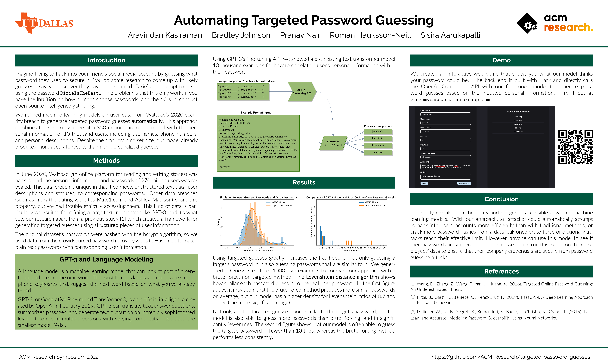
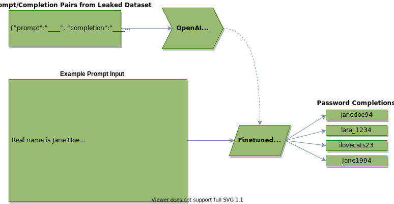
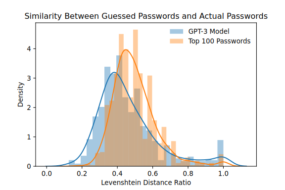
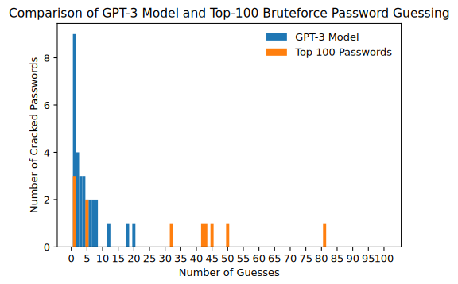
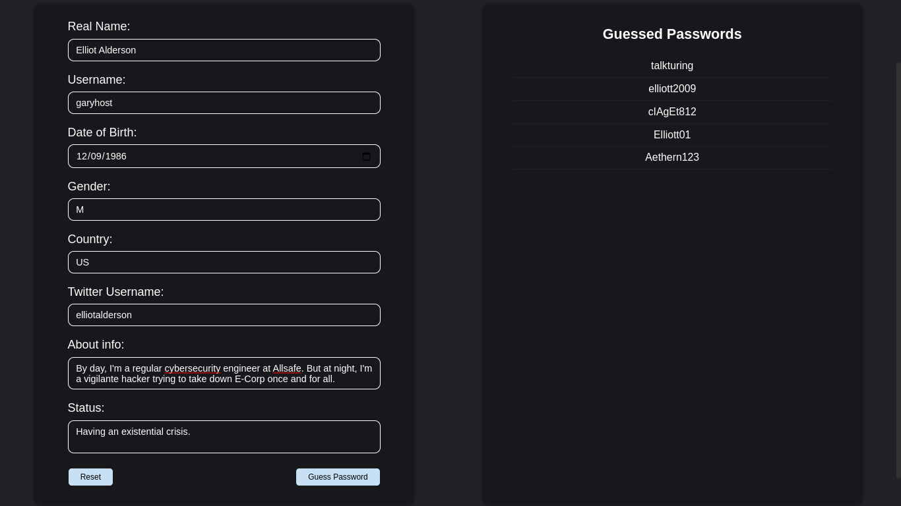

# Automating Targeted Password Guessing

*Faculty Advisor: [Dr. Wei Yang](http://youngwei.com)*  •  *Team Lead: [Roman Hauksson-Neill](https://github.com/romanhn)*\
*[Aravindan Kasiraman](https://cubetastic33.github.io)  •  [Bradley Johnson](https://www.linkedin.com/in/bradwj)  •  [Pranav Nair](https://github.com/pranavn21)  •  [Sisira Aarukapalli](https://github.com/ccgsisig)*\
*[ACM Research](https://acmutd.co/research) at the University of Texas at Dallas*

## Introduction

Imagine trying to hack into your friend's social media account by guessing what password they used to secure it. You do some research to come up with likely guesses – say, you discover they have a dog named "Dixie" and attempt to log in using the password `DixieIsTheBest1`. The problem is that this only works if you have the intuition on how humans choose passwords, and the skills to conduct open-source intelligence gathering.

We refined machine learning models on user data from Wattpad's 2020 security breach to generate targeted password guesses **automatically**. This approach combines the vast knowledge of a 350 million parameter–model with the personal information of 10 thousand users, including usernames, phone numbers, and personal descriptions. Despite the small training set size, our model already produces more accurate results than non-personalized guesses.

## About

[ACM Research](https://acmutd.co/research) is a division of the Association of Computing Machinery at the University of Texas at Dallas. Over 10 weeks, six 4-person teams work with a team lead and a faculty advisor on a research project about anything from [phishing email detection](https://github.com/ACM-Research/thephishingproject) to [virtual reality video compression](https://github.com/ACM-Research/vr-user-behavior-clustering). [Applications]([https://acmutd.co/apply/](https://acm-utd.us.auth0.com/u/login?state=hKFo2SBqaVo3aDFHeXlRaUVzd1FKVHh2TGtMUDlyZER0dDExM6Fur3VuaXZlcnNhbC1sb2dpbqN0aWTZIHdNNHUybEZyckF6Y2hKaFpnOGhNVUhmeWJWeklPTUlCo2NpZNkgRnNxalhPRXZURHZUM3d5M09qWkdtYnZLMTVyMmZsTVM)) to participate open each semester.

## Methods

In June 2020, Wattpad (an online platform for reading and writing stories) was hacked, and the personal information and passwords of 270 million users was revealed. This data breach is unique in that it connects unstructured text data (user descriptions and statuses) to corresponding passwords. Other data breaches (such as from the dating websites Mate1.com and Ashley Madison) share this property, but we had trouble ethically accessing them. This kind of data is particularly well-suited for refining a large text transformer like GPT-3, and it's what sets our research apart from a previous study[^1] which created a framework for generating targeted guesses using **structured** pieces of user information.
    
The original dataset's passwords were hashed with the bcrypt algorithm, so we used data from the crowdsourced password recovery website Hashmob to match plain text passwords with corresponding user information.
    
> ### GPT-3 and Language Modeling
>
> A language model is a machine learning model that can look at part of a sentence and predict the next word. The most famous language models are smartphone keyboards that suggest the next word based on what you've already typed.
>
> GPT-3, or Generative Pre-trained Transformer 3, is an artificial intelligence created by OpenAI in February 2019. GPT-3 can translate text, answer questions, summarizes passages, and generate text output on an incredibly sophisticated level. It comes in multiple versions with varying complexity – we used the smallest model "Ada".

Using GPT-3's fine-tuning API, we showed a pre-existing text transformer model 10 thousand examples for how to correlate a user's personal information with their password.

## Results

Using targeted guesses greatly increases the likelihood of not only guessing a target's password, but also guessing passwords that are similar to it. We generated 20 guesses each for 1000 user examples to compare our approach with a brute-force, non-targeted method. The **Levenshtein distance algorithm** shows how similar each password guess is to the real user password. In the first figure above, it may seem that the brute-force method produces more similar passwords on average, but our model has a higher density for Levenshtein ratios of 0.7 and above (the more significant range).

Not only are the targeted guesses more similar to the target's password, but the model is also able to guess more passwords than brute-forcing, and in significantly fewer tries. The second figure shows that our model is often able to guess the target's password in **fewer than 10 tries**, whereas the brute-forcing method performs less consistently.
        
## Demo
    
We created an interactive web demo that shows you what our model thinks your password could be. The back end is built with Flask and directly calls the OpenAI Completion API with our fine-tuned model to generate password guesses based on the inputted personal information. Try it out at [guessmypassword.herokuapp.com](https://guessmypassword.herokuapp.com).
    

## Conclusion

Our study reveals both the utility and danger of accessible advanced machine learning models. With our approach, an attacker could automatically attempt to hack into users' accounts more efficiently than with traditional methods, or crack more password hashes from a data leak once brute-force or dictionary attacks reach their effective limit. However, anyone can use this model to see if their passwords are vulnerable, and businesses could run this model on their employees' data to ensure that their company credentials are secure from password guessing attacks.

## References

[^1]: Wang, D., Zhang, Z., Wang, P., Yan, J., Huang, X. (2016). Targeted Online Password Guessing: An Underestimated Threat.
[^2]: Hitaj, B., Gasti, P., Ateniese, G.,  Perez-Cruz, F. (2019). PassGAN: A Deep Learning Approach for Password Guessing.
[^3]: Melicher, W., Ur, B., Segreti, S., Komanduri, S., Bauer, L., Christin, N.,  Cranor, L. (2016). Fast, Lean, and Accurate: Modeling Password Guessability Using Neural Networks.
